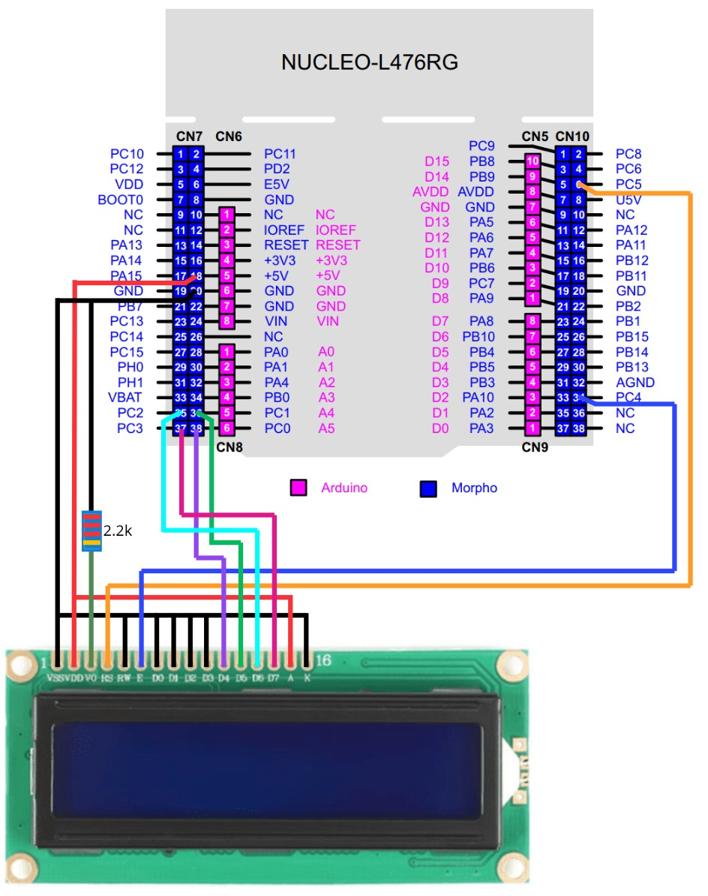

# STM32 Blinky
This repository serves as a starting point for bare-metal C projects. The directory structure,
build system, guidelines, and other specifics are inspired by the [Embedded System Project Series](https://www.youtube.com/watch?v=g9KbXJydf8I&list=PLS_iNJJVTtiRV0DZRDcTHnvAuDrKGPN40) from [Artful Bytes](artfulbytes.com). The `Blinky` project also serves as an example/test project for the Nucleo-L476RG development board.

## Example and Testing Features
The project holds the following features, which can be used to verify proper functionality of the board. Not every feature has to be enabled for testing and demonstration. To enable or disable a test feature, comment in or out the respective lines in `src/main.c`.
``` C
#define __LED_TEST
#define __UART_TEST
#define __LCD_TEST
and so on ...
```
The currently available test features are
- LED Blink
- UART message transmit
- UART message receive
- LCD character display

### LED Blink
The on-board LD2 LED blinks at a constant rate, determined by the `DELAY_COUNT` macro defined in `src/main.c`.

### UART Message Transmit
The string `"Sending test string!\r\n"` is transmitted by USART2 through the virtual ST-Link virtual COM port. To view the message open a serial terminal such as [PuTTY](https://www.chiark.greenend.org.uk/~sgtatham/putty/latest.html) on Windows, and configure it to your specific COM port used by the STLink Virtual COM port. The default baud rate of the `Blinky` project is `115200`, which can be configured in `src/drivers/uart.c`.

### UART Message Receive
Entering single keys into the same serial terminal in which the test message is sent, will send the keys to the board. The board they echos the keys back out to the serial terminal.

### LCD Character Display
Connect a 16x2 character LCD compatible with a HD44780 controller, such as the [QAPASS 1602A](https://www.digikey.com/en/products/detail/midas-displays/MD21605G12W3-BNMLW-VE/13970969?s=N4IgTCBcDaILYBMwEYBsAGArAc2WA7gMwgC6AvkA), to demonstrate the `Blinky` project LCD driver feature. The connections for the LCD are detailed in the diagram below. In addition to the `Hello World!` test message, characters received from the UART are also printed on the second line.



## Directory Structure
The directory structure is based on the [pitchfork layout](https://github.com/vector-of-bool/pitchfork).

| Directory     | Description                                                   |
|---------------|---------------------------------------------------------------|
| build/        | Build output (object files + executable)                      |
| docs/         | Documentation (e.g., coding guidelines, images)               |
| src/          | Source files (.c/.h)                                          |
| src/app/      | Source files for the application layer (see SW architecture)  |
| src/common/  | Source files for code used across the project                  |
| src/drivers/ | Source files for the driver layer (see SW architecture)        |
| src/test/    | Source files related to test code                              |
| external/    | External dependencies (as git submodules if possible)          |
| tools/       | Scripts, configs, binaries                                     |
| .github/     | Configuration file for GitHub actions                          |

## Build
The project is intended to be built using command-line tools (i.e. make), but
and IDE could also be used for step debugging.

## make (Makefile)
The code targets the STM32L476RGTx (Nucleo-L476RG development board) and must be built
with a cross-toolchain. The toolchain used for this project is arm-none-eabi-gcc, which
is included in the repository under `tools/`. The toolchain can also be found
on [Arm's website](https://developer.arm.com/Tools%20and%20Software/GNU%20Toolchain)

There is a _Makefile_ to build the code with _make_ from the command-line.

## Tests
**TODO**

## Pushing a new change
These are teh typical steps take for each change

1. Create a local branch
2. Make the code changes
3. Build the code
4. Flash and test the code on the target
5. Static analyse the code
6. Format the code
7. Commit the code
8. Push the branch to GitHub
9. Open a pull-request
10. Merge the pull request

## Commit Message
Commit messages should follow the specification laid out by [Conventional Commits](https://www.conventionalcommits.org/en/v1.0.0/).

## Code Formatter
The codebase follows certain formatting rules, which are enforced by the code formatter **clang-format**. These rules are specified in teh **.clang-format** located in the root directory. There is a rule in the **Makefile** to format all source files with one command (requires clang-format to be installed).
``` Bash
make format
```

Sometimes it's desirable to ignore these formatting rules, and this can be achieved with special comments.

`` C
// clang-format off
<code to ignore>
// clang-format on
```

## **TODO** Coding guidelines
Apart from the basic formatting rules, the codebase also follows certain coding guidelines.
These are described in **docs/coding_guidelines.md**.

## Static Analysis
To catch coding mistakes early on (in addition to the ones the compiler catches), I use a static analyzer, **cppcheck**. There is a rule in the **Makefile** to analyse all files with **cppcheck**.

``` Bash
make cppcheck
```

## Things to include per project
This project can be used as a template for starting new projects. Each new project should include several items of documentation, diagrams, and outlines. These items include hardware schematics, software architecture, block diagrams, and state machines.
